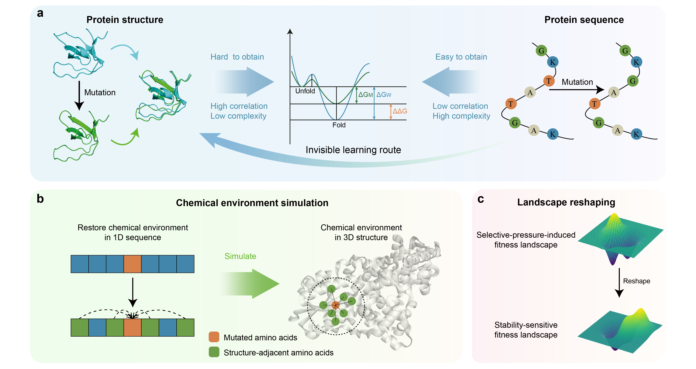

# S3C
The official code of "Towards anchoring evolutionary fitness for protein stability with virtual chemical environment recovery"


## Table of Contents
- [Overview](#overview)
- [Data](#data)
- [Model inference](#model-inference)
- [Model training](#model-training)
- [License](#license)

## Overview
Protein stability offers valuable insights into protein folding and functionality, making it an integral component of evolutionary fitness. Previous computational methods possess both strengths and weaknesses, leading to practical and inter- pretational limitations. Here, we propose an interpretable protein stability change prediction method, S3C, to anchor evolutionary fitness for protein stability with virtual chemical environment recovery. S3C first gets rid of the shackles of high-resolution protein structure data and restores the local chemical environments of the mutations at the sequence level. Subsequently, S3C promotes the evolutionary fitness of protein stability to dominate the fitness landscape under the selective pressure. Naturally, S3C comprehensively outperforms state-of-the-art methods on benchmark datasets while showing ideal generalization when migrated to unseen protein families. More importantly, S3C is demonstrated to be interpretable at multiple scales, including high-fidelity recovery of local structure micro-environment, perception of intricate interaction reconstruction, and accurate mining of rare beneficial mutations. S3C expands the boundaries of protein evolution prediction and provides an ideal candidate for large-scale optimization of protein engineering.
## Hardware requirements

The experiments are tested on one Tesla V100 (32GB).

## Data
Training and testing data are in the "data" folder.
Download mega-scale dataset for training at [mega-scale dataset](https://zenodo.org/records/7401275)

## Model inference
Download the checkpoint of S3C and modify the paths in the code.
| Content  | Link  |
| ----- | -----|
| Checkpoint on S6070 | [link](https://figshare.com/ndownloader/files/46044900) |

To test S3C on different test datas, please run
```python
python test.py
```
## Model training
To train S3C on downstream tasks from scratch, please run
```python
python train.py
```
## License
This project is licensed under the [MIT License](LICENSE).